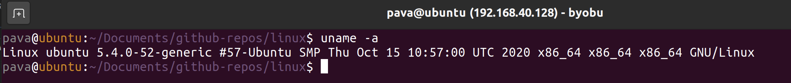
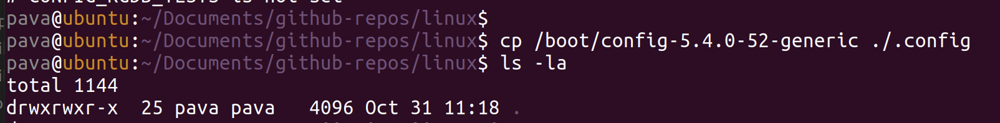
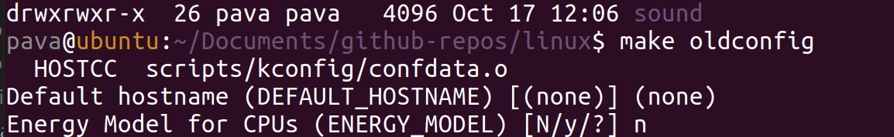
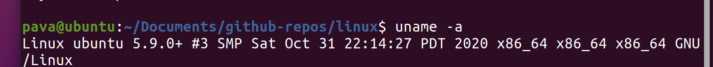
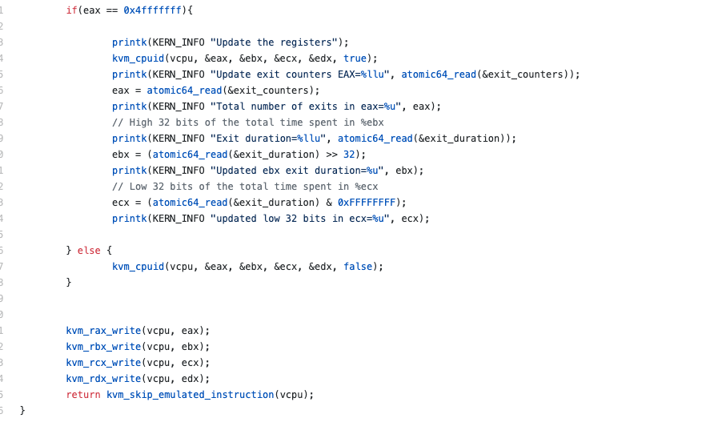
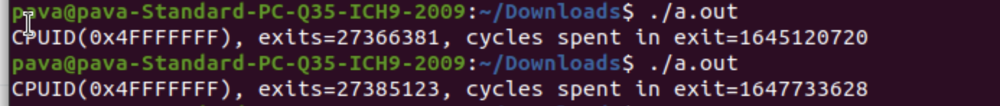
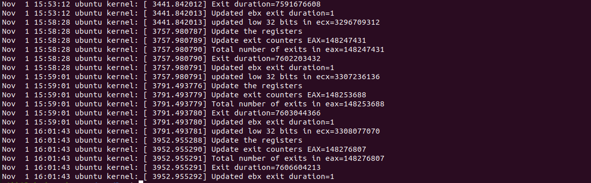

# CMPE283-Assignment2
#### Group -
#### Shreya Ghotankar - 015304393
#### Parvathi Pai - 015293460

#### Assignment
Your assignment is to modify the CPUID emulation code in KVM to report back additional information
when a special CPUID “leaf function” is called.
* For CPUID leaf function %eax=0x4FFFFFFF:
* Return the total number of exits (all types) in %eax
* Return the high 32 bits of the total time spent processing all exits in %ebx
* Return the low 32 bits of the total time spent processing all exits in %ecx
* %ebx and %ecx return values are measured in processor cycles

### For each member in your team, provide 1 paragraph detailing what parts of the lab that member implemented / researched. (You may skip this question if you are doing the lab by yourself).

#### Shreya Ghotankar:
* Revisited the video lecture 5
* Compiled the code with modifications
* Made changes to fix the errors occurred while compiling
* Created nested VM to run the test program
* Created documentation.

#### Parvathi Pai:
* Revisited the video lecture 5
* Modified the cupid.c and vmx.c modules
* Looked up how to perform testing for kernel code
* Wrote a test program
* Updated documentation

## Steps followed –
#### Initial Setup
1. Clone the Kernel code from GitHub: git clone https://github.com/torvalds/linux.git
2. Kernel Code Compilation :
* Perform all the actions in the root mode using the command - sudo bash
* Install the build-essential kernel-package,  bison package (parser generator) and flex libelf-dev (parser package).
  apt-get install build-essential kernel-package fakeroot libncurses5-dev libssl-dev ccache bison flex libelf-dev
* uname -a
  
* Change the .Config file
  cp -v /boot/config-5.4.0-52-generic ./.config
  
*  Make the file - make oldconfig
* 
* make -j
* sudo make modules
* sudo make install
* sudo make modules_install
* reboot
* Verify the updated Linux version - uname -a
  

#### Build
1. After the initial setup is complete modify the cpuid.c file using VS code or any other editor.
     
  Set up an atomic counter at the exit locations of the vmx.c files and calculate the counts and total time spent during the exits.
2. Complie the code using – sudo make -j && make modules && make install && make modules_install

### Set up KVM
1. We followed the instructions in this manual to set up the KVM in our Ubuntu 
   https://help.ubuntu.com/community/KVM/Installation
2. In the  Installation section of the KVM guide we made use of Cosmic (18.10) or later packages.
   sudo apt-get install qemu-kvm libvirt-daemon-system libvirt-clients bridge-utils
3. Installed the virt-manager using- 
   sudo apt-get install virt-manager

### Starting the nested virtual machine using KVM

1) Downloaded ubuntu iso
2) Created new VM from Virtual Machine Manager application
3) Created a test program and compiled it.

  ### Result:
3. From test program

Varified the result

1. From host VM kern.log – tail -n20 /var/log/kern.log

### Comment on the frequency of exits –

  1. Does the number of exits increase at a stable rate? Or are there more exits performed during certain VM operations? 
  No, the number of exits increase is not at stable rate. There are other VM instructions/operations because of which the exits are performed like EPT violation, RDRAND, I/O instruction, RDTSCP etc.

  2. Approximately how many exits does a full VM boot entail?
    The number of exits after the first build, reboot and enter nested VM using the KVM is 187,420. This is not very accurate as there might have been a shudown period and hardware interrupts in-between.

### References
1. https://help.ubuntu.com/community/KVM/Installation
2. https://elixir.bootlin.com/linux/v5.10-rc2/source/include/asm-generic/atomic-instrumented.h
3. https://www.kernel.org/doc/html/v4.12/core-api/atomic_ops.html
4. https://lwn.net/Kernel/
