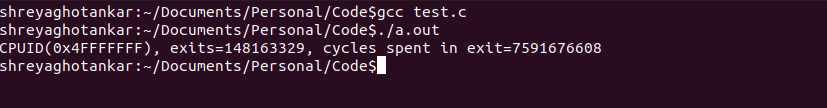

# CMPE283-Assignment2
#### Group -
#### Parvathi Pai - 015293460
#### Shreya Ghotankar - 015304393

#### Assignment
Your assignment is to modify the CPUID emulation code in KVM to report back additional information
when a special CPUID “leaf function” is called.
* For CPUID leaf function %eax=0x4FFFFFFF:
* Return the total number of exits (all types) in %eax
* Return the high 32 bits of the total time spent processing all exits in %ebx
* Return the low 32 bits of the total time spent processing all exits in %ecx
* %ebx and %ecx return values are measured in processor cycles

### For each member in your team, provide 1 paragraph detailing what parts of the lab that member implemented / researched. (You may skip this question if you are doing the lab by yourself).

#### Parvathi Pai:
* Revisited the video lecture 5
* Modified the cupid.c and vmx.c modules
* Looked up how to perform testing for kernel code
* Wrote a test program
* Updated documentation

#### Shreya Ghotankar:
* Revisited the video lecture 5
* Compiled the code with modifications
* Made changes to fix the errors occurred while compiling
* Created nested VM to run the test program
* Created documentation.

## Steps followed –

1. Clone the Kernel code from GitHub: git clone https://github.com/torvalds/linux.git
2. Kernel Code Compilation :
* sudo apt-get install build-essential kernel-package fakeroot libncurses5-dev libssl-dev ccache bison flex libelf-dev
* uname -a
* cp -v /boot/config-5.4.0-52-generic ./.config
* make oldconfig
* make -j
* sudo make modules
* sudo make install
* sudo make modules_install
* reboot
* uname -a

3. Modified the cupid.c and vmx.c files for CPUID leaf function eax=0X4fffffff
4. Complied the code – sudo make -j && make modules && make install && make modules_install
5. Now to insert the newly built kvm run following commands:
* sudo rmmod kvm_intel
* sudo rmmod kvm
* sudo insmod arch/x86/kvm/kvm.ko
* sudo insmod arch/x86/kvm/kvm-intel.ko
6. For testing the changes, we created a nested VM and ran our test program.
* sudo apt install qemu-kvm libvirt-clients libvirt-daemon-system bridge-utils virt-manager
* sudo systemctl status libvirtd
* downloaded ubuntu iso
* created new VM from Virtual Machine Manager application
* created a test program and compiled it.

  ### Result:
1. From test program

2. From host VM kern.log – tail -n20 /var/log/kern.log

### Comment on the frequency of exits – does the number of exits increase at a stable rate? Or are there more exits performed during certain VM operations? Approximately how many exits does a full VM boot entail?
No, the number of exits increase is not at stable rate. There are other VM instructions/operations because of which the exits are performed like EPT violation, RDRAND, I/O instruction, RDTSCP etc.
